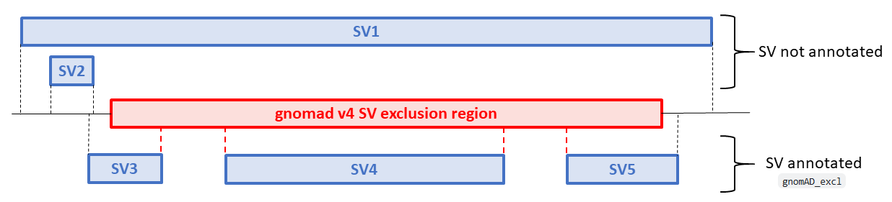

<div align="center">
  <h1 style="font-weight: bold; margin-bottom: 0.2em;">breakpoint2BedSV</h1>
  <h3 style="margin-top: 0;">Convert SV breakpoints from VCF/BCF to BED</h3>
</div>

- [Why extracting start/end SV breakpoints from a VCF is not trivial](#why-extracting-startend-sv-breakpoints-from-a-vcf-is-not-trivial)
- [Requirements](#requirements)
- [Quick Installation](#quick-installation)
  - [Install from PyPI](#install-from-pypi)
  - [Upgrade](#upgrade)
  - [Install from GitHub](#install-from-github)
  - [Run the test suite](#run-the-test-suite)
- [Command line usage / Options](#command-line-usage--options)
- [Outputs](#outputs)
- [Variant filtering rules](#variant-filtering-rules)
  - [Behavior](#behavior)
- [How to cite?](#how-to-cite)
- [Example application: Cohort assessment of SV presence/absence using gnomAD v4 SVs as reference](#example-application-cohort-assessment-of-sv-presenceabsence-using-gnomad-v4-svs-as-reference)
- [License](#license)

## Why extracting start/end SV breakpoints from a VCF is not trivial

In an SV VCF, the first breakpoint is usually straightforward to retrieve from the `CHROM` and `POS` columns.
However, the second breakpoint is not encoded in a single standardized way and may appear in different fields depending on the SV type or the caller.

| SV representation                                               | First breakpoint | Second breakpoint                        |
| --------------------------------------------------------------- | ---------------- | ---------------------------------------- |
| Symbolic allele (`<DEL>`, `<DUP>`, `<INV>`, `<CNV>`)            | `CHROM:POS`      | usually `INFO/END`                       |
| Breakend notation (e.g. `]chr13:53040041]ATATATATACACACA`)      | `CHROM:POS`      | embedded in the `ALT` field              |
| Sequence notation (e.g. INS: `REF=A` and `ALT=ATGATTCGTTCTG...`)| `CHROM:POS`      | embedded in the `REF` field              |
| Sequence notation (e.g. DEL: `REF=TGGAATTAGCCTG...` and `ALT=T`)| `CHROM:POS`      | embedded in the `REF` field              |
| Caller-specific representations                                 | `CHROM:POS`      | may use alternative tags such as `SVEND` |

As a consequence, extracting both breakpoints from an SV VCF requires handling multiple representations.
`breakpoint2BedSV` addresses this issue by converting heterogeneous SV representations into a unified BED-like breakpoint format.

## Requirements
<i>cf</i> [`pyproject.toml`](pyproject.toml)

## Quick Installation

### Install from PyPI

The recommended way to install `breakpoint2BedSV` is with `pip`:

```bash
pip install breakpoint2bedsv
```

Then verify the installation:

```bash
breakpoint2bedsv --help
```

### Upgrade

To upgrade to the latest version:

```bash
pip install --upgrade breakpoint2bedsv
```

### Install from GitHub

To install the latest development version directly from GitHub:

```bash
git clone https://github.com/lgmgeo/breakpoint2BedSV.git
cd breakpoint2BedSV
poetry install
```

Then run:

```bash
poetry run breakpoint2bedsv --help
```

### Run the test suite

To run all tests locally:

```bash
poetry run pytest -v
```

To list the collected tests without executing them:

```bash
poetry run pytest --collect-only
```

The test data and test scripts are located in the `tests/` directory.

All tests are also executed automatically through GitHub Actions on each push and pull request.


## Command line usage / Options

```bash
usage: breakpoint2bedsv [-h] [-V] [--log-file <File>] -i <File> [-d <Dir>] -o <File> [-T <Dir>] [-v]

Convert SV breakpoints from VCF/BCF to BED

optional arguments:
  -h, --help            show this help message and exit
  -V, --version         show program's version number and exit
  --log-file <File>     write log messages to the specified file

Input files:
  -i <File>, --input-file <File>
                        the SV VCF/BCF input file
                        VCF/VCF.gz/BCF files are supported
                        multi-allelic lines are not allowed
                        required

Output options:
  -d <Dir>, --output-dir <Dir>
                        the output directory
                        default: current directory
  -o <File>, --output-file <File>
                        output BED file containing non redundant SV breakpoints
                        (VCF/BCF IDs are merged as a comma-separated list when
                        multiple variants share the same coordinates)
                        required

Behavior:
  -T <Dir>, --tmp-dir <Dir>
                        directory where temporary files will be created
                        if not provided, the system default temporary directory is used
  -v, --verbose         enable verbose output
```

## Outputs

Running the tool will generate a BED output file with SV start/end coordinates and the associated VCF ID.
Redundant genomic coordinates are merged into a single BED entry, with multiple VCF IDs reported as a comma-separated list.

## Variant filtering rules

`breakpoint2BedSV` only processes structural variants compatible with breakpoint-based BED representation.

During parsing, the following records are automatically ignored:
- FILTER = `MULTIALLELIC` (including MCNV-like multi-allelic CNV representations)
- ALT = `<BND>` (breakend complex rearrangements)
- ALT = `<CPX>` (complex structural variants)
- ALT = `<CTX>` (complex translocations)

### Behavior
- These variants are **skipped during parsing**
- They are **not written to the output BED file**
- The number of skipped records is reported as a warning in the standard output

## How to cite?

Please cite the following doi if you are using this tool in your research:<br>
[](https://doi.org/10.5281/zenodo.21134592)

## Example application: Cohort assessment of SV presence/absence using gnomAD v4 SVs as reference

**Aim**

=> Annotate PE/SR-based SVs in a VCF with a `gnomAD_excl` flag when at least one breakpoint overlaps a gnomAD v4 SV exclusion region.
(<i>cf</i> <a href="https://discuss.gnomad.broadinstitute.org/t/centromeric-del-detected-by-manta-and-visible-in-coverage-but-missing-from-gnomad-sv/833" target="_blank">discussion</a> in the gnomAD forum)



**Workflow**

```text
SV VCF
  │
  ├── breakpoint2BedSV
  │      → convert all SVs into breakpoint-level BED intervals
  │
  ├── bedtools intersect
  │      → overlap SV breakpoints with gnomAD v4 SV exclusion regions
  │
  ├── collect overlapping SV IDs
  │
  └── annotate VCF
         → add INFO flag: gnomAD_excl
```

**GRCh38 gnomAD exclusion resources**

SV calling is less reliable in some genomic regions due to:

- low mappability / depth bias
- peri-centromeric or peri-telomeric repeats
- known problematic regions in population datasets such as gnomAD

Two GRCh38 gnomAD exclusion regions:

- `depth_blacklist.sorted.bed.gz`
- `PESR.encode.peri_all.repeats.delly.hg38.blacklist.sorted.bed.gz`

```bash
curl -O https://storage.googleapis.com/gatk-sv-resources-public/hg38/v0/sv-resources/resources/v1/depth_blacklist.sorted.bed.gz
curl -O  https://storage.googleapis.com/gatk-sv-resources-public/hg38/v0/sv-resources/resources/v1/PESR.encode.peri_all.repeats.delly.hg38.blacklist.sorted.bed.gz
```

**Output**

SVs with at least one breakpoint overlapping one of these exclusion regions are flagged in the VCF with:

```vcf
##INFO=<ID=gnomAD_excl,Number=0,Type=Flag,Description="At least one SV breakpoint overlaps a gnomAD exclusion region">
```

**Implementation**

 1. Convert SV VCF to breakpoint BED format

```bash
breakpoint2BedSV \
  --vcf input.vcf \
  --output sv.breakpoints.bed
```

This step standardizes all SV representations (DEL/DUP/INV/BND/SVEND) into a unified breakpoint BED format.

---

 2. Identify SVs overlapping gnomAD v4 exclusion regions

```bash
bedtools intersect \
  -a sv.breakpoints.bed \
  -b depth_blacklist.sorted.bed.gz \
  -wa | cut -f4 | sort -u > excluded_ids.txt

bedtools intersect \
  -a sv.breakpoints.bed \
  -b PESR.encode.peri_all.repeats.delly.hg38.blacklist.sorted.bed.gz \
  -wa | cut -f4 | sort -u >> excluded_ids.txt

tr "," "\n" < excluded_ids.txt | sort -u > excluded_ids.final.txt
rm excluded_ids.txt
```

---

 3. Annotate original VCF with `gnomAD_excl` flag

```bash
awk -F'\t' '
BEGIN {
    OFS="\t"
    while ((getline line < "excluded_ids.final.txt") > 0)
        excl[line] = 1
}
{
    if ($0 ~ /^#/) {
        print
        next
    }

    id = $3

    if (id in excl) {
        if ($8 == "." || $8 == "") {
            $8 = "gnomAD_excl"
        } else {
            $8 = $8 ";gnomAD_excl"
        }
    }

    print
}
' input.vcf > input.gnomAD_excl.vcf
```

## License

breakpoint2bedsv is free software: you can redistribute it and/or modify
it under the terms of the GNU General Public License as published by
the Free Software Foundation, either version 3 of the License, or
(at your option) any later version.

breakpoint2bedsv is distributed in the hope that it will be useful,
but WITHOUT ANY WARRANTY; without even the implied warranty of
MERCHANTABILITY or FITNESS FOR A PARTICULAR PURPOSE. See the
GNU General Public License for more details.

See the `LICENSE` file for the full license text.